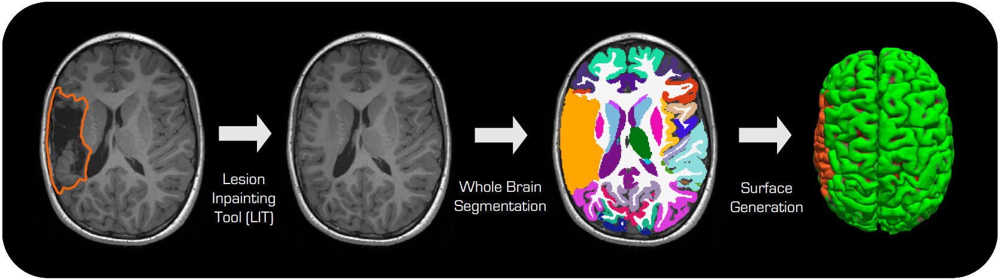

.. LIT - Lesion Inpainting Tool documentation master file

Welcome to LIT's Documentation!
================================

**LIT (Lesion Inpainting Tool)** is a tool for inpainting lesions in brain MRI images, independent of their shape or appearance, for further downstream analysis.

This tool can be run standalone or in conjunction with FastSurfer for whole brain segmentation and cortical surface reconstruction. It can also mask tumor regions in the FastSurfer outputs.

🔥 **Key Features**
-------------------

* Inpaints lesions of any shape or appearance in T1-weighted MRI images
* Standalone operation or integration with FastSurfer
* Docker and Singularity containerization support
* PyPI package available for easy installation
* Surface and segmentation masking capabilities

Quick Start
-----------

Using Docker/Singularity (Recommended)
~~~~~~~~~~~~~~~~~~~~~~~~~~~~~~~~~~~~~~

.. code-block:: bash

   git clone https://github.com/Deep-MI/LIT.git && cd LIT
   ./LIT/scripts/run_lit_containerized.sh --input_image T1w.nii.gz \\
       --mask_image lesion_mask.nii.gz --output_directory output_directory

Using PyPI Package
~~~~~~~~~~~~~~~~~~

.. code-block:: bash

   # Install the package
   pip install -i https://test.pypi.org/simple/ lesion-inpainting-tool
   
   # Download model checkpoints
   lit-download-models
   
   # Run LIT
   run-lit --input_image T1w.nii.gz --mask_image lesion_mask.nii.gz \\
       --output_directory output_directory --dilate 2

.. toctree::
   :maxdepth: 2
   :caption: User Guide

   installation
   usage
   integration
   training

.. toctree::
   :maxdepth: 2
   :caption: API Reference

   api/modules

.. toctree::
   :maxdepth: 1
   :caption: Getting Started

   QUICKSTART
   README

.. toctree::
   :maxdepth: 1
   :caption: Development

   contributing
   changelog

.. toctree::
   :maxdepth: 1
   :caption: Reference

   citation
   license

Indices and tables
==================

* :ref:`genindex`
* :ref:`modindex`
* :ref:`search`

